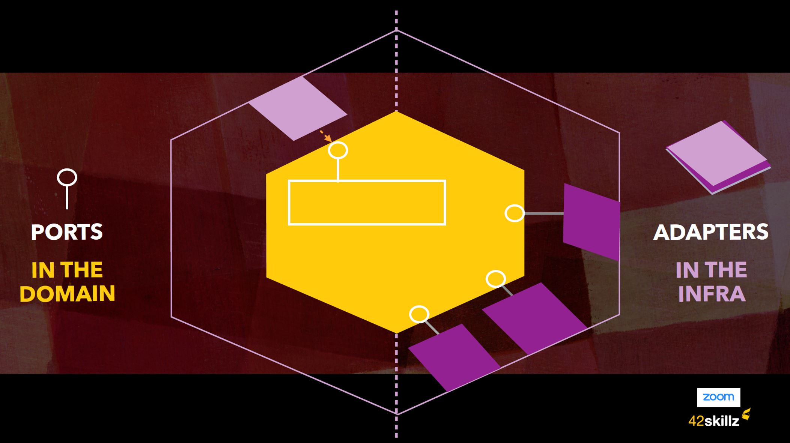
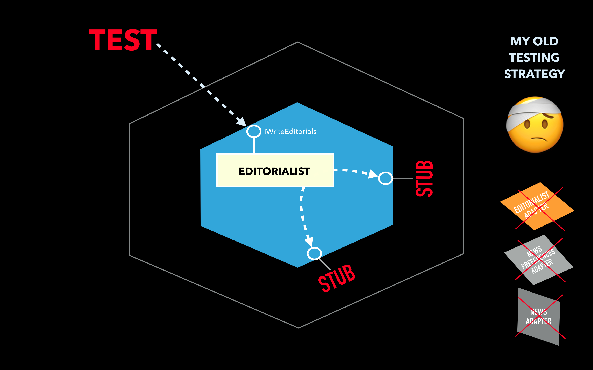

# Hexagonal Architecture code sample

__Thomas Pierrain__

This solution is used to support various hands-on labs built and used for one of our DDD training course with Bruno Boucard (and Kenny Baas-Schwegler)

__>> THE "Hexagonal" BRANCH <<__ 

or this repo hosts __a typical Hexagonal Architecture structure__.

 

## Description of the solution

Our domain is “to find the best possible suggestions of Seats to make for a group of people that want to go to a Theater Show”. Our *suggestions* are made to please our Customers so that they will then transform one of our *__SeatsSuggestions__* (with various *__Pricing Categories__*) into a real *Reservation Request* afterwards, handled by another Service.

To make *Seats Suggestions*, we follow the rules defined from our Business applied to our concept of *__AuditoriumSeating__*

__[Visual Examples here](./AuditoriumLayoutExamples.md)__

‪
To get our *__AuditoriumSeating__* to work with, our Hexagon/Service/API needs to collaborate with 2 others Web APIs managed by 2 other teams (working each in their own different *Bounded Contexts*). One providing the topology of the auditorium for a given Show. The other providing the list of already reserved seats for this show (and supporting the *Reservation Transactions* too).

After combining those various information into our *AuditoriumSeating* types, our system must suggest seats fiting the requirement of our business (we want every party to be located in *adjacent seats*, we want to be as much as possible located in the *center of a row*, etc). 

Our *SeatSuggestion* Domain is just here to make suggestions of *Seats* in various *Pricing Categories* before the customer will try to transform one of our *Suggestion* into a real *Reservation* afterward.

Here are the projects of our solution:

 - __SeatsSuggestions.Domain__: the project hosting the core domain of Theater Seat Suggestions with:
  
   - __[IRequestSuggestions](./SeatsSuggestions.Domain/Ports/IRequestSuggestions.cs)__: the left-side port to enter the hexagon (you can notice that we are using Value types from our Domain here in the port method's signature)
   
   - __[IProvideUpToDateAuditoriumSeating](./SeatsSuggestions.Domain/Ports/IProvideUpToDateAuditoriumSeating.cs)__: the right-side port to leave the hexagon. Since every Port belongs to the Domain, its signature use types from our Domain (like the ShowId Value type here). 
   
   - __[SeatAllocator](./SeatsSuggestions.Domain/SeatAllocator.cs)__ the *Hexagon* (implementing the __IRequestSuggestions__ left-side port)
   
   - __[The rest of our core domain](./SeatsSuggestions.Domain/)__ (no technical frameworks involved here. Pure Domain only). Without any surprise this is the main part of our code base.
   
 
 - __SeatsSuggestions.Infra__: the project hosting some infrastructure-level types such has the "AuditoriumSeatingAdapter" right-side Adapter (implementing the IProvideUpToDateAuditoriumSeating port). One can notice that we could have put all this project's content within the __SeatsSuggesion.Api__ one.
 
   - __[Adapter/AuditoriumSeatingAdapter](./SeatsSuggestions.Infra/Adapter/AuditoriumSeatingAdapter.cs)__: the right-side Adapter that will produce __AuditoriumSeating__ instances from 2 other Bounded Contexts (__AuditoriumLayout.Api__ and __SeatReservations.Api__ as described below) 

 
 - __SeatsSuggestions.Api__: the ASP.NET core project hosting the web controllers (our left-side adapter here), the swagger doc, etc.
 
   - __[SeatsSuggestionsController](./SeatsSuggestions.Api/Controllers/SeatsSuggestionsController.cs)__: the Web Controller that will act as our left-side Adapter to enter into the *Hexagon*.

 
 - __SeatsSuggestions.Tests__: the project containing all the tests. The coarse-grained Acceptance tests (the outer loop), the fine-grained unit tests (the inner loop). So far there is some integration tests but they should be more and located in a dedicated project IMO (TBD) 
 
--- 

In order to be fully autonomous when launching our API, the visual studio solution also contains 2 fake web APIs supported by other teams / other Bounded Contexts: 

 - __AuditoriumLayout.Api__: the web API providing the topology of an auditorium giving the identifier of a Show. This web API belongs to the *Auditorium topologies* Bounded Context (the one knowing in relation with all the Theaters involved in Shows). 
 
 - __SeatReservations.Api__: the web API providing the list of already reserved seats for a given Show. This web API belongs to the *Reservation* Bounded Context (the one dealing with the Booking Transactions).
 
To launch the solution, please configure a multi-project startup in visual studio, with all *.API involved  
 

## About the testing strategy

This solution also illustrates the testing strategy that I described __[in my blog post here](http://tpierrain.blogspot.com/2020/03/hexagonal-architecture-dont-get-lost-on.html)__.

This testing strategy includes the usage of all the Adapters within the coarse-grained Acceptance tests, stubbing only the last-miles I/Os (here Http calls to external web APIs) so that we are able to catch all the tiny mistakes and bugs one can have within the right-side Adapters (here only one: the __AuditoriumSeatingAdapter__ and all its collaborators:  *SeatReservationsWebClient* and *AuditoriumWebRepository*).

Here is a typical test fixture for blazing-fast Coarse-grained Acceptance tests but involving the Adapters:
 
 - __[SeatsSuggestionsControllerShould.cs](./TheaterSuggestions.Tests/AcceptanceTests/SeatsSuggestionsControllerShould.cs)__
 
Here is a typical fine-grained unit test:
 - __[SeatShould.cs](./TheaterSuggestions.Tests/UnitTests/SeatShould.cs)__

Note: for now the solution is missing the Contract-Integration tests harness that checks our Fake-Stubs has the exact same behaviour than the concrete adapters plugged into the real external APIs. This will be added soon.

---

Even if the Domain is different, here is my old testing strategy for the coarse-grained Acceptance tests illustrated:

 

And my new testing strategy for the coarse-grained Acceptance tests (i.e. the one in place in that __'Hexagonal' branch__:

 

Feel free to interact via PR or even better, via twitter HERE: __[@tpierrain](https://twitter.com/tpierrain/status/1254183257140342784?s=21)__

